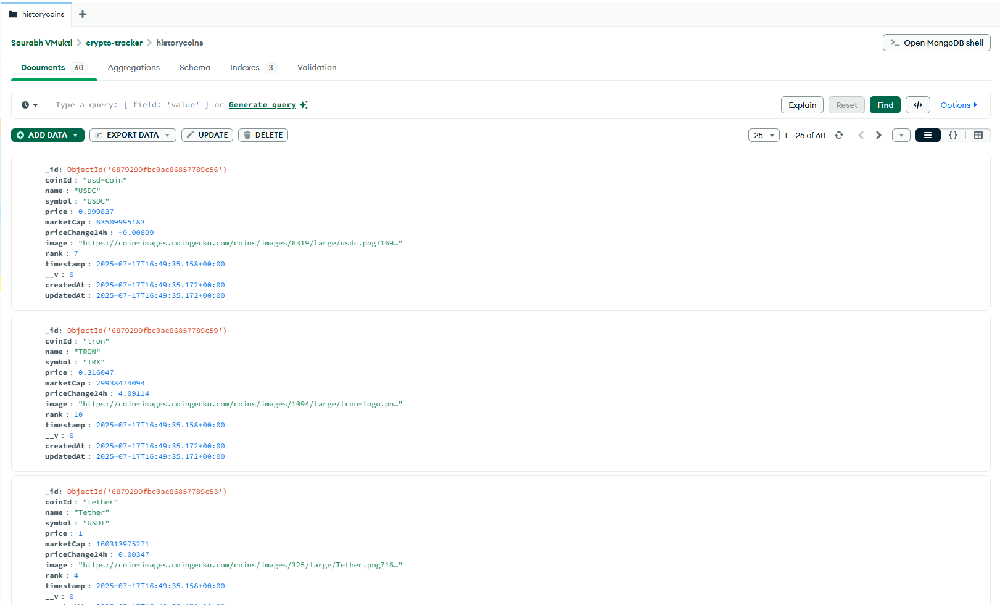

# 🪙 CryptoTracker Backend

This is the **backend API** for the CryptoTracker application. It fetches, stores, and serves cryptocurrency data using the **CoinGecko API**, **MongoDB**, and **Express.js**. A cron job runs every hour to update current and historical coin data automatically.

---

## 🚀 Tech Stack

- **Node.js**
- **Express.js**
- **MongoDB + Mongoose**
- **CoinGecko API**
- **Node-Cron** (for scheduled data fetching)
- **dotenv** (for environment variable management)

---

## 📦 Project Structure

```
crypto-tracker-backend/
├── models/
│ └── Coin.js
├── routes/
│ └── coins.js
├── services/
│ ├── coinGeckoService.js
│ └── cronService.js
├── .env
├── index.js
├── package.json
├── package-lock.js
└── readme.md
```

---

## ⚙️ Setup & Installation

### 1. Clone the repository

```bash
git clone https://github.com/saurabhkumardev/crypto-tracker-backend.git
cd crypto-tracker-backend
```

### 2. Install dependencies

```bash
npm install
```

### 3. Configure environment variables

- Create a .env file in the root directory:

```env
MONGODB_URI=mongodb://localhost:27017/cryptotracker
PORT=5000
CLIENT_URL=http://localhost:3000
NODE_ENV=development
```

### 4. Run the server

```bash
npm run dev
```

---
<br />

- Server will run at: http://localhost:5000

<br />

---

## ⏰ Cron Job – Hourly Coin Data Sync

- A cron job runs every hour to:
- Fetch top 10 coin data from the CoinGecko API.
- Update the CurrentCoin collection using upsert.
- Insert a snapshot into the HistoryCoin collection.
- Delete historical data older than 30 days.


### Cron Job Code:

- Located at: services/cronService.js

```
cron.schedule("0 * * * *", () => {
  this.updateCoinData()
}, { timezone: "UTC" })
```

- Also runs immediately after server starts (with 5-second delay).

## 📡 External API Used
- CoinGecko API
- Base URL: https://api.coingecko.com/api/v3
- Endpoint Used: /coins/markets?vs_currency=usd&order=market_cap_desc&per_page=10&page=1


## 📁 MongoDB Collections
🔸 CurrentCoin
Stores latest data of top 10 coins (upserted each hour).

🔸 HistoryCoin
Stores hourly snapshots of coin data for tracking trends and charts.

🔌 API Endpoints
- All routes are prefixed with /api

```
Method	      Endpoint	            Description
GET	          /api/coins	        Get current coin data
GET	          /api/coins/history	Get historical data by coinId and days
```

# 🌐 Deployment Links
🔗 Backend API: https://your-backend.onrender.com/api

🔗 Frontend App: https://your-frontend.vercel.app

## 🧪 Testing the API

- You can test the endpoints using:
  - Postman
  - Browser (for GET)


Example:
 - curl http://localhost:5000/api/coins


## 📞 Contact

- 💼 linkedin.com/in/saurabhkumardev
- 📧 saurabhkumarmehto@gmail.com


## DB (History crypto)


## Cron job (Code)
